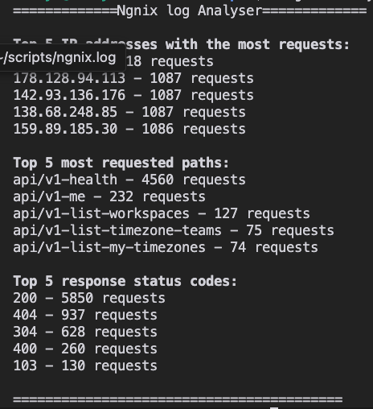

# Nginx Log Analyser 

**Script that analyses the [log file](ngnix.log) and shows the following:**
- Top 5 IP addresses with the most requests
- Top 5 most requested paths
- Top 5 response status codes

## How to use it?

### 1. Download the bash file

    curl -O "https://raw.githubusercontent.com/AdityaPGit/roadmap.sh-devops/refs/heads/main/ngnix-log-analyser/ngnix-log-analyser.sh" 

### 2. Download the log file    
    curl -O "https://raw.githubusercontent.com/AdityaPGit/roadmap.sh-devops/refs/heads/main/ngnix-log-analyser/ngnix.log"

### 3. Add execution permissions
    chmod +x ngnix-log-analyser.sh

### 4. Execute the file
    ./ngnix-log-analyser.sh

### Here's how the result should look

