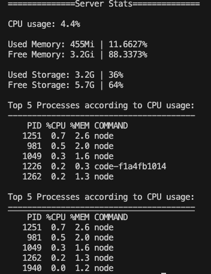

# Server Stats Analyser

**Script which shows the following:**
- Currently used RAM in numbers and percentage
- Currently used Storage in numbers and percentage
- Top 5 processes according to CPU usage
- Top 5 processes according to RAM usage

## How to use it?

### 1. Download the file

    curl -O https://raw.githubusercontent.com/AdityaPGit/roadmap.sh-devops/refs/heads/main/server-stats/server-stats.sh

### 2. Add execution permissions
    chmod +x server-stats.sh

### 3. Execute the file
    ./serverstats.sh

### Here's how the result should look

