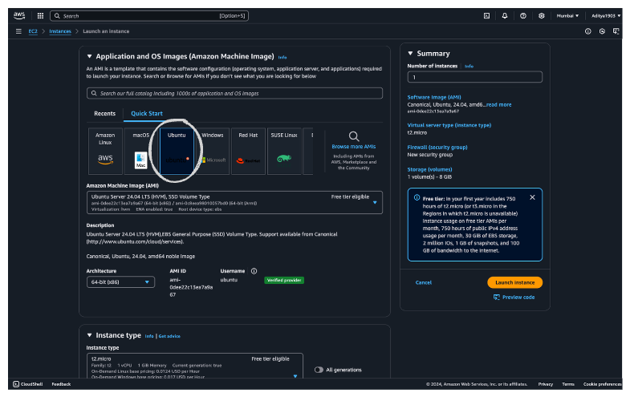
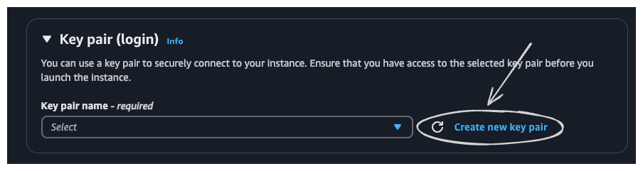
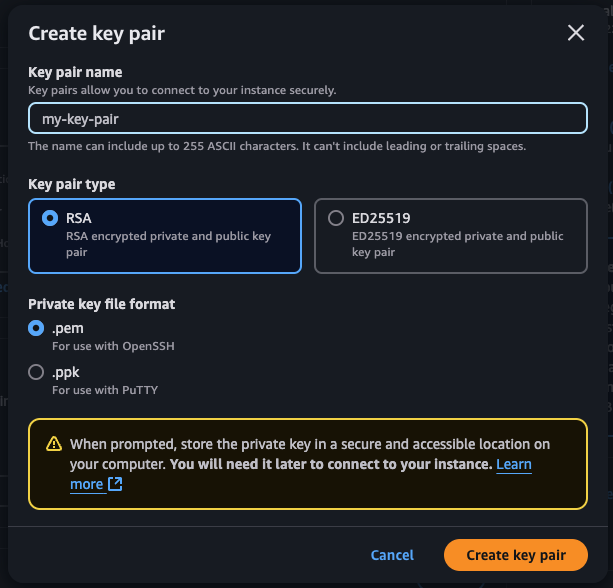
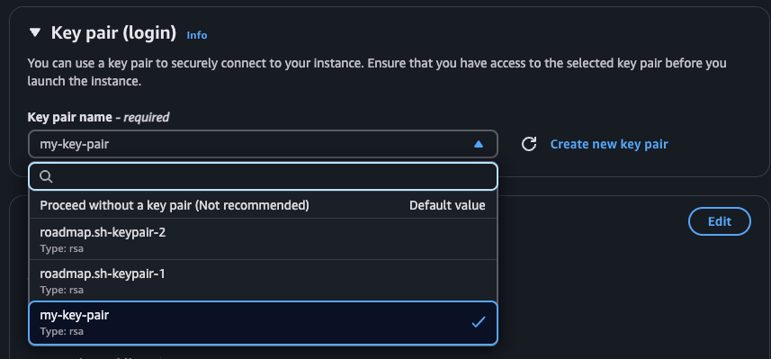
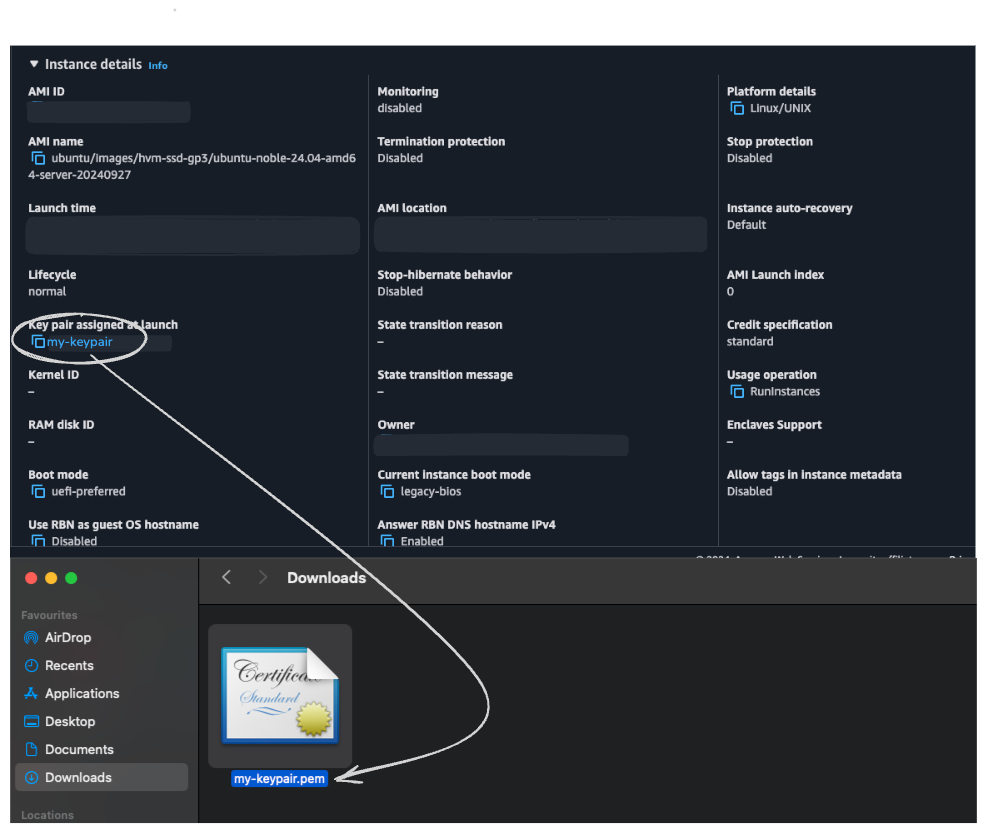
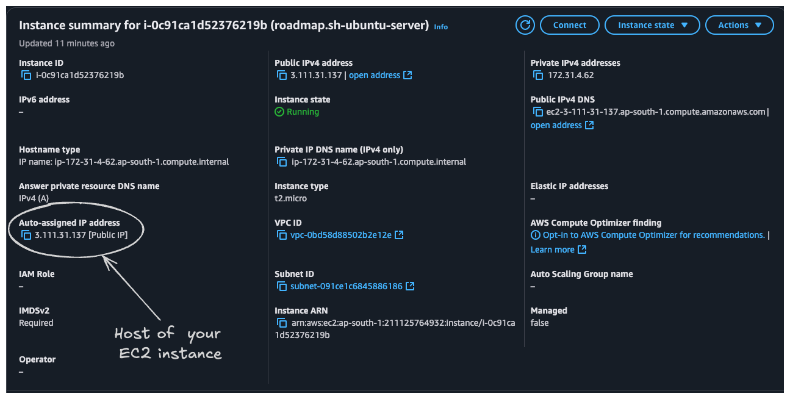

# SSH Remote Server Setup

- Step by Step guide on how to ssh into an EC2 instance using Macos's inbuilt ssh client

## Step 1: Launching the EC2 instance

1) Go the AWS console and visit the EC2 console and click on "Launch Instance"

    

2) Before launching the instance, create a keypair for safely accessing your EC2 instance later

    

3) Name your key pair and hit create. Now you keypair has been created. Save the downloaded .pem file and move it to a safer and accessible folder

    

4) Don't forget to associate the newly created ssh key with your EC2 instance

    

5) Now hit launch instance. Now you have your ubuntu EC2 instance running

## Step 2: SSHing into the Ubuntu EC2 instance

1) **Open the Terminal and connect too your EC2 using the following command:**

    `ssh -i /path/to/your/my-keypair.pem username@host`

    Confused? Let's break it down!

    - The path is the directory to which the file is stored. For example, the file is stored in the downloads folder. Then the directory would be: 
    
        `/Users/adityapandey/downloads/my-keypair.pem`

        Note: The file name  of the keypair and file name on the console should be same.

    

    - The username for a ubuntu EC2 instance is `ubuntu`. The username may vary if you are trying to access any other type of EC2 instance. You can find the default usernames [here](https://docs.aws.amazon.com/AWSEC2/latest/UserGuide/managing-users.html#ami-default-user-names)

    - The host is the public ip address assigned to your EC2 instance by AWS. This is where you can find it on the EC2 console:

    

    After following the above steps, the command on hitting enter should connect you with the  EC2 instance.

2) **Adding your EC2 to config for fast access**

    It's tiring to recursively type the same command again and again. But we can fix that  easily by adding the EC2's properties in the config file!
    
    a. Change directory to the  ssh folder:

        cd ~/.ssh

    b. Check the files in the directory. Look for a file called "config"

        ls
    
    c. Now, use the the following command to edit the config file

        nano config

    d. Now, edit and paste this format in the file: 

        Host <yourdesiredname>
        HostName <hostame>
        User ubuntu
        Port 22
        IdentityFile /path/to/your/my-keypair.pem

    e. After you're done, used `ctrl+x`, type `y`, and hit `enter`

    f. Now we have a shortcut to access our EC2 rather than typing everything everytime

    g. Now use the following command to instantly connect to your EC2 instance:
    
        ssh <yourdesiredname>

    The `<yourdesiredname>` is called the alias. You can name it anything of your liking. Now using this simple command you can access your EC2 very quickly